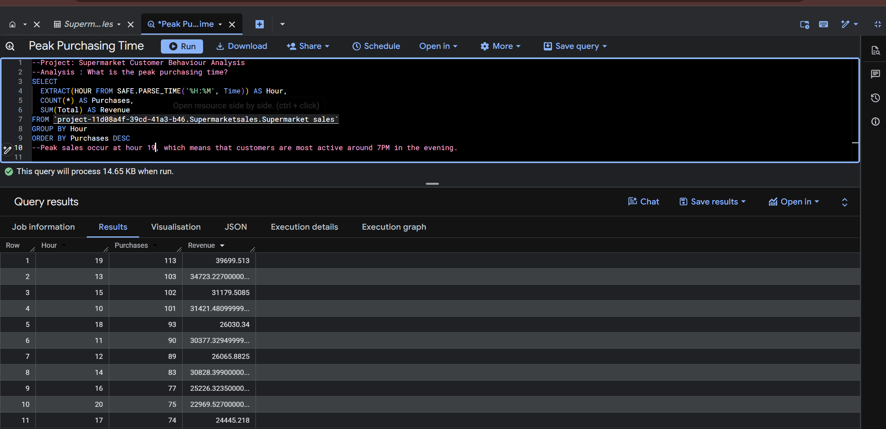
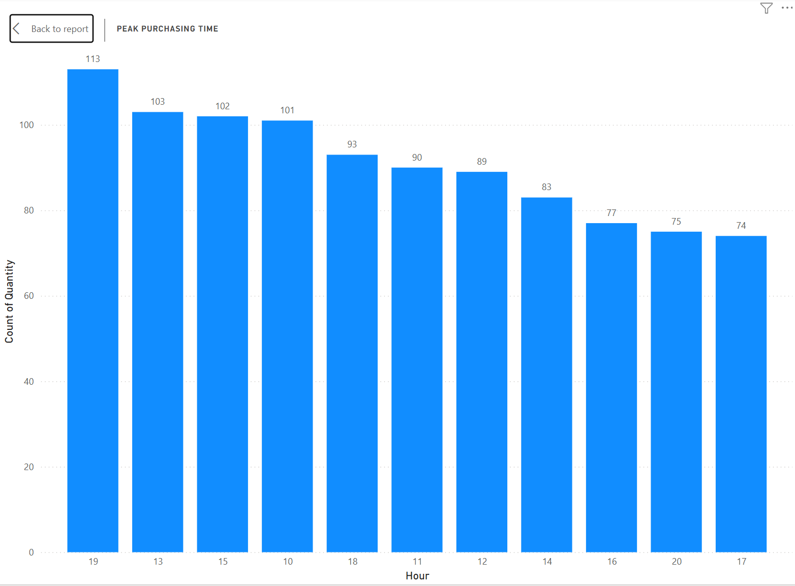
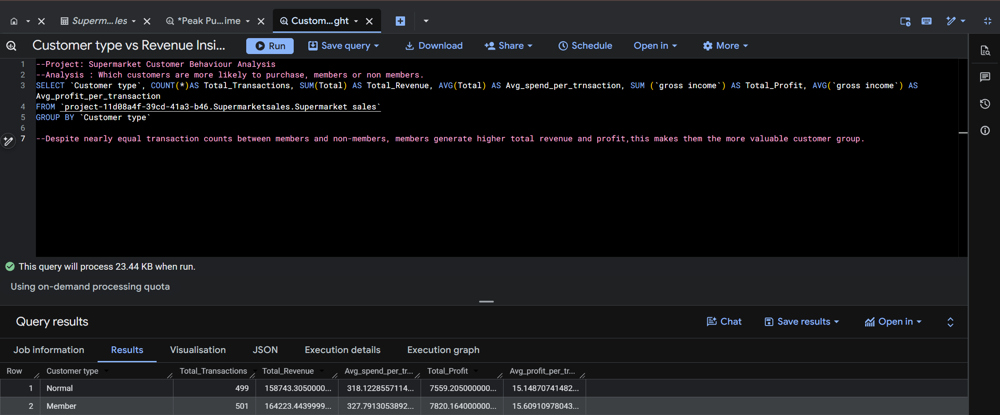
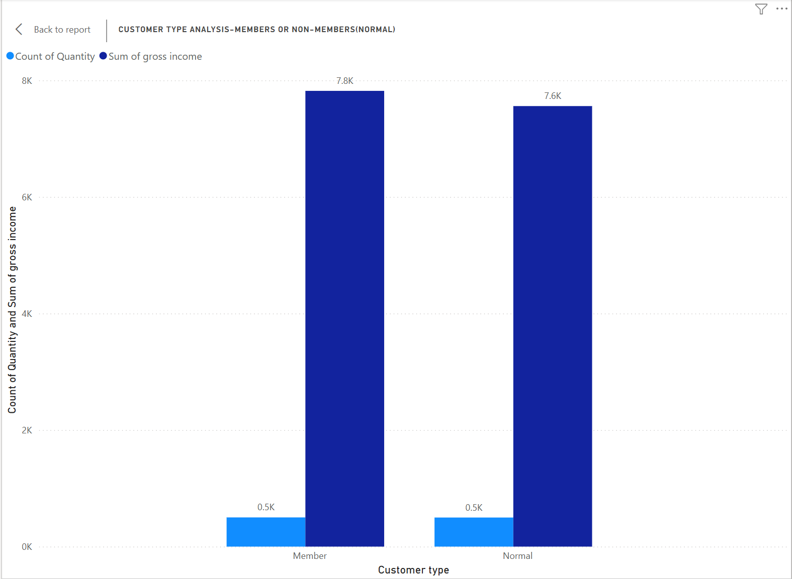
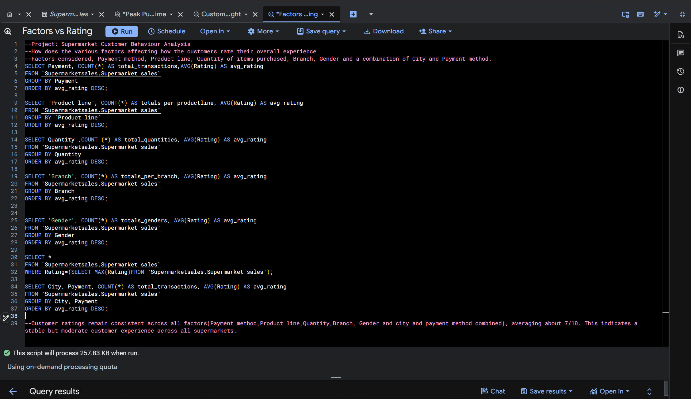
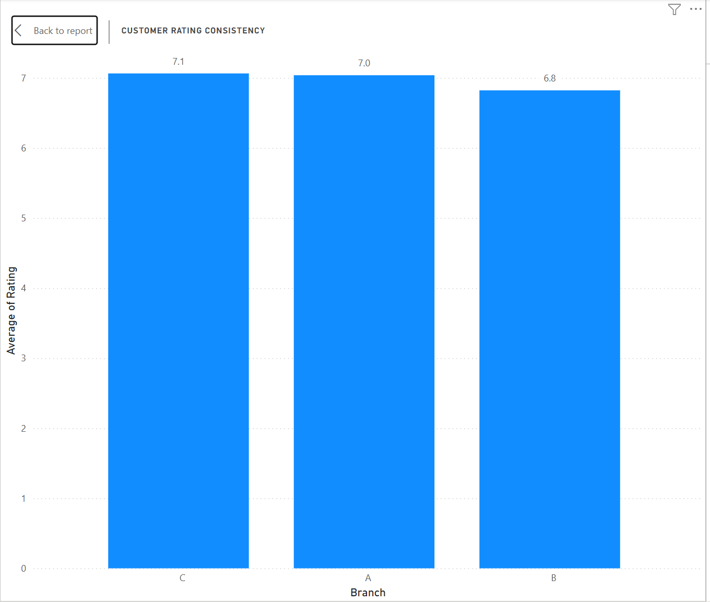
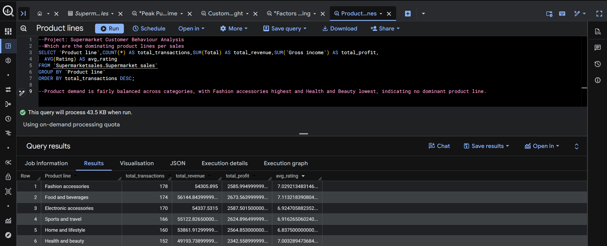
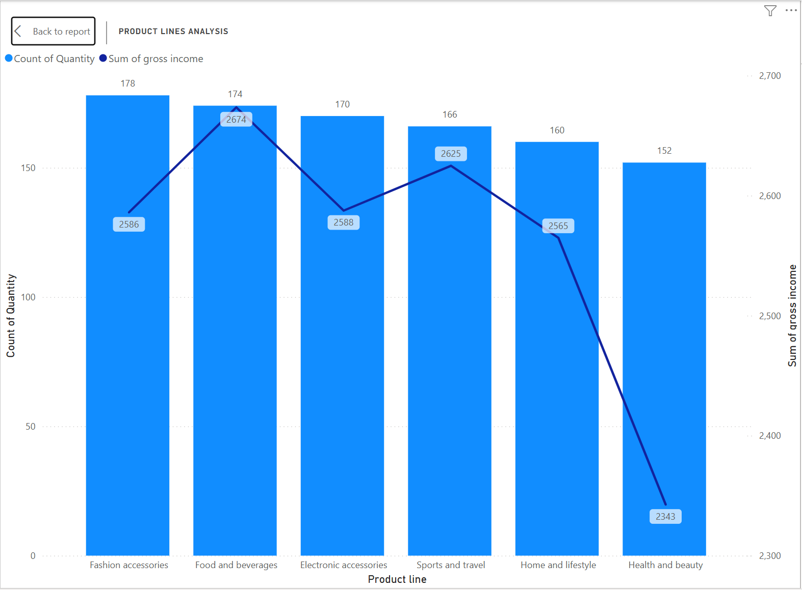
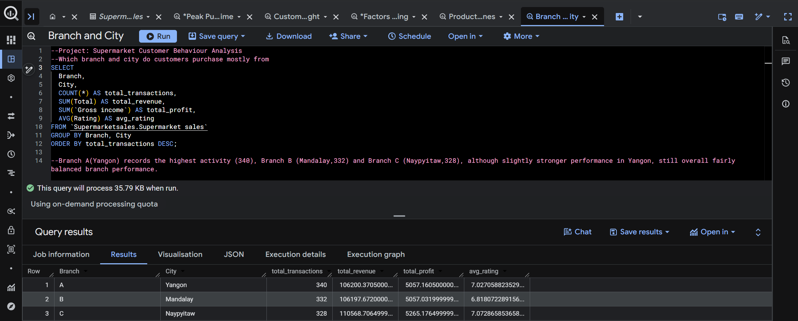
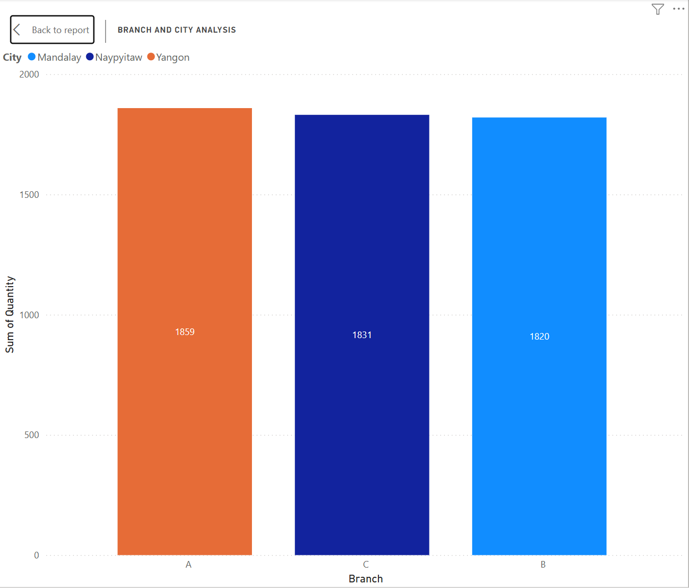

# Supermarket Customer Insights(SQL Project)

This project analyzes supermarket sales data using SQL to understand customer behaviour.

## Objectives
- Identify peak shopping times
- Analyze customer types(members vs non-members)
- Evaluate various factors vs ratings.Factors include payment methods, product lines, quantity, branch, gender and city/payment method.
- Understand product performance
- Compare branch performance

## Key Insights

### Peak Time
Customers mostly shop at 7PM (Hour 19)

### Customer Type
Members generate higher revenue and profit than non-members

### Various factors vs rating
Rating stay constant across factors. Stable but moderate customer experience across all supermarkets

### Product Performance
Fashion Accessories perform best, while Health & Beauty is lowest

### Branch Performance
Branch A(Yangon) performs slightly better than others

## Conclusion
The supermarket shows consistent customer satisfaction and balanced product demand. Members are the most valuable customer group, and peak activity occurs in the evening.

## Tools Used
- SQL
- BigQuery (Google Cloud Platform)
- Kaggle Dataset
- GitHub

